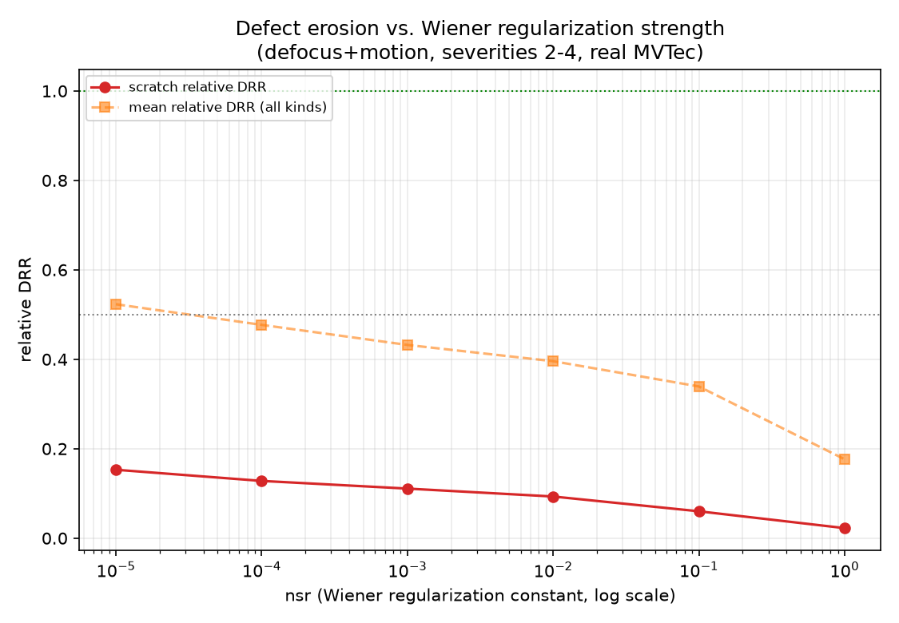
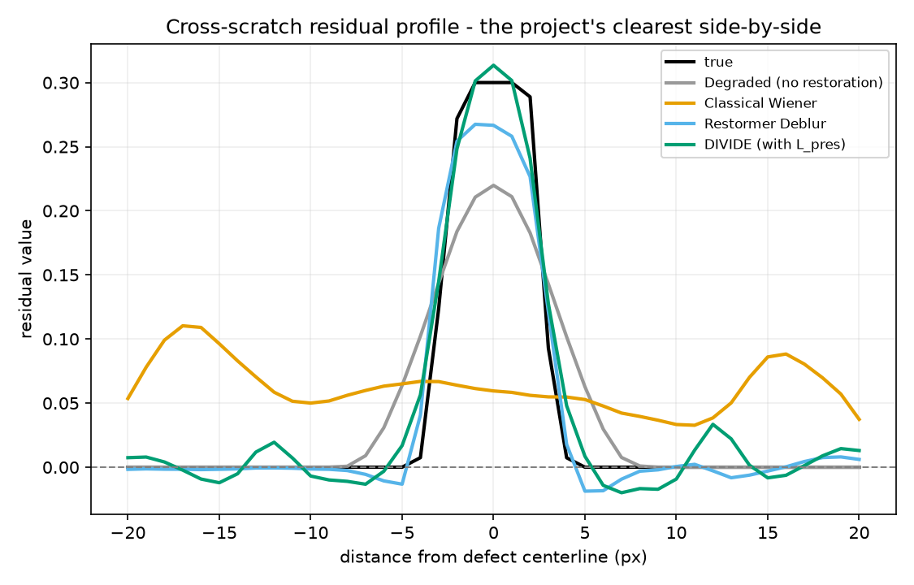
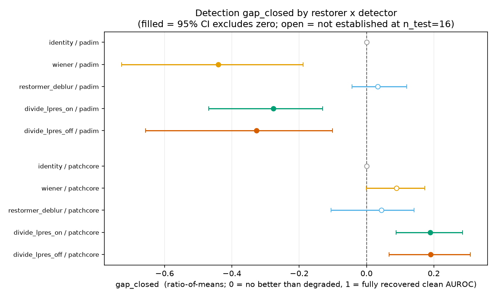
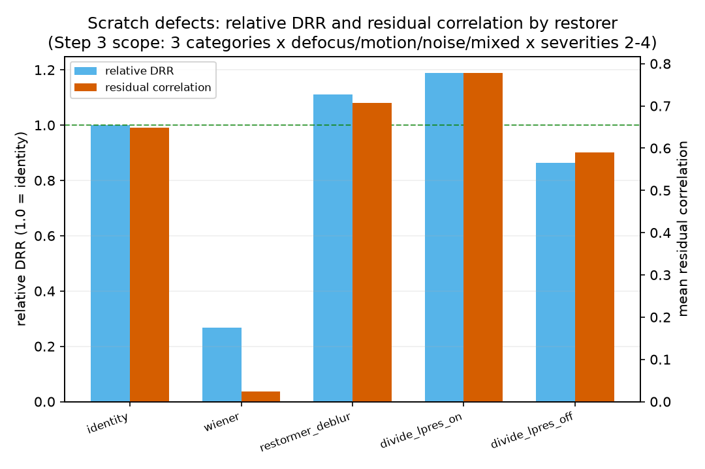

# FINDINGS

Digital Image Processing (BCSE403L), VIT Vellore. This document reports
three things at different levels of confidence, deliberately kept separate:

1. **The single-shot vs. iterative deconvolution mechanism — established,
   corrected once.** The most striking, best-supported result this project
   has produced, and the one everything after it builds on: single-shot
   Wiener deconvolution replaces a defect's residual with ringing at the
   same location, regardless of regularization strength; PCIM's unrolled,
   iterative structure does not. This project originally described this as
   "erasure" — a direct pixel-level and profile inspection (Sec. 1.1) found
   that framing was wrong about *what* is destroyed, corrected here rather
   than left standing. This comes first because it is why the rest of the
   document is worth reading, not an afterthought to it.
2. **The L_pres claim — established.** A 150-example held-out bootstrap
   comparison of the two final L_pres-ablation checkpoints, refining the
   mechanism above: given PCIM's iterative structure already avoids this
   failure, does the *additional* preservation loss term do anything?
3. **The detection-grid results — mixed confidence, reported honestly.**
   A 360-cell frozen-detector grid, gated by a harness-correctness check and
   a bootstrap CI on every headline number, because the first pass produced
   a result (PatchCore clean AUROC 20 points below published) that turned
   out to be a data-scale artifact, not a real detector finding — and
   several of the grid's apparent effects do not survive resampling. That
   same data-scale finding turns out to bound what the detection result
   itself is entitled to claim.

Every number below is in a committed CSV/JSON under `results/`, traceable to
the script that produced it. No number here was estimated or interpolated.

---

## 1. Single-shot vs. iterative deconvolution — the mechanism (established)

**Question:** DIVIDE's whole architecture is premised on avoiding a defect-
destroying failure a naive inverse filter causes. Is that actually true,
and if so, is it regularization tuning or something structural?

**Method 1 — regularization sweep.** `src/experiments/wiener_regularization_sweep.py`
swept classical Wiener's noise-to-signal regularization constant across five
orders of magnitude, 1e-5 to 1.0 (`results/wiener_nsr_sweep_summary.csv`),
measuring scratch residual correlation at each setting — the *shape* check
(Pearson correlation between restored and true residual, mean-centred
within the defect mask), used alongside DRR because a restorer can leave
residual energy at a defect's location with roughly the right magnitude but
the wrong shape; DRR alone cannot tell that apart from genuine
preservation, especially once DRR approaches or exceeds 1.0. Sections 2 and
3 both rely on this same distinction.

| nsr | 1e-5 | 1e-4 | 1e-3 | 1e-2 | 1e-1 | 1.0 |
|---|---|---|---|---|---|---|
| scratch residual corr | 0.028 | 0.013 | −0.017 | −0.058 | −0.040 | 0.120 |

Across five orders of magnitude of the one knob a single-shot Wiener filter
has, scratch residual correlation **stays within noise of zero throughout**
(−0.058 to +0.120) — the residual's *shape* fails to track the true
defect's shape at every setting tested. Regularization tuning cannot fix
this. **This is not the same as the defect being attenuated or absent** —
Sec. 1.1 shows the residual's energy survives; read the "erosion" language
in the original write-up of this sweep as shape-correlation collapsing,
not magnitude vanishing.

**Method 2 — bridging ablation.** `src/models/wiener_ablation.py`'s five
configurations walk from classical Wiener to PCIM's own `x_cons` path one
variable at a time (`results/wiener_bridge_ablation_summary.csv`), isolating
which single change flips the outcome:

| step | change | scratch relative DRR | scratch residual corr |
|---|---|---|---|
| A | classical Wiener, flat nsr | 0.079 | −0.058 |
| B | + nsr derived from DBDE's own estimate | 0.129 | −0.053 |
| C | + unrolled HQS (5 iterations, growing ρ), still raw-pixel domain | 1.377 | **0.864** |
| D | + VST/illumination domain (= PCIM's `x_cons`) | 1.379 | 0.859 |
| E | `x_cons`, regularization floor removed | 1.319 | 0.563 |

At matched regularization magnitude, switching one-shot division (B) for
unrolled half-quadratic splitting (C) flips scratch residual correlation
from −0.053 to 0.864 in one step, nothing else changed — the defect's
residual goes from structurally destroyed to genuinely preserved.
**Iteration, not regularization strength, is what separates structural
destruction from preservation.** Regularization still has a real, smaller
job: config E shows removing PCIM's `nsr_floor` keeps the shape-preserving
property (0.563, nowhere near A/B's near-zero) but loses the extra gain
C/D show — adequate regularization is what turns "no worse than doing
nothing" into "measurably better," but iteration is what prevents the
failure in the first place.

### 1.1 Correction: single-shot Wiener does not erase the defect — it replaces its structure with ringing at the same location

**This corrects the "erasure"/"gone" language used above and in earlier
versions of this document and `README.md`.** Building the demo (Step 4)
required visualizing exactly what a restored residual looks like, not just
its summary statistics — and direct pixel inspection of the striking case
(`bottle`/`scratch`/`defocus`, severity 4; `demo_data/manifest.json`,
`src/demo/precompute.py`) showed the original claim was imprecise about
*what* single-shot Wiener destroys.

**The residual's energy survives, at nearly the true peak magnitude, at
the right location.** Within the defect mask (524 pixels), the true
residual is uniformly positive, +0.075 to +0.300. Wiener's residual over
the *same* 524 pixels ranges −0.034 to +0.296 — its peak (0.296) is barely
below the true residual's peak (0.300), and its global maximum anywhere in
the image (0.306) sits immediately adjacent to the mask. The energy is not
gone. What's gone is the **sign pattern**: the true residual never changes
sign inside the mask; Wiener's flips repeatedly, pixel to pixel — which is
exactly what collapses `defect_residual_correlation` to near zero (0.008
for this example) without collapsing the magnitude ratio `relative_drr` to
zero either (0.146 — reduced, not absent).

**The cross-defect residual profile makes this legible in one picture** —
a slice perpendicular to the defect, true residual vs. every restorer's, on
one axis (the exact visualization: skeletonize the mask, sample the
residual along the normal at a few points near the middle, average):

True and DIVIDE both show a single, clean, centered bump. Wiener shows
**no clean peak at the center at all** — its energy is smeared into broad
ringing lobes on either side of the true location, barely elevated above
its own sidelobes at distance zero. This is the textbook signature of
deconvolution ringing: energy displaced from an edge into oscillating
lobes around it, not removed. `demo_data/manifest.json`'s per-panel
sign-agreement maps (green where a restorer's residual sign matches the
true residual's, red where it flips) show the same thing pixel by pixel.

**Restated precisely:** single-shot Wiener deconvolution does not erase a
defect. It replaces the defect's residual with a ringing artifact
concentrated at the same edge, with comparable peak magnitude but a
structurally scrambled sign pattern — which is why `relative_drr` reads
reduced-but-nonzero (0.15–0.35 depending on example) while
`defect_residual_correlation` reads near zero. "Erosion"/"gone" language
elsewhere in this project's history described the correlation collapsing,
not the energy vanishing; read it that way.

**Hypothesis, not a result, flagged as such:** ringing is itself a form of
local structure the region didn't have before — plausibly anomalous in its
own right, independent of whatever the true defect looked like. This is a
candidate explanation for Section 3.2's finding that `wiener` on PatchCore
has a small, only marginally-established detection benefit (gap_closed
+0.089, 95% CI [−0.001, 0.173], touching zero) despite `relative_drr`
showing real residual reduction: PatchCore may be flagging the region
because ringing itself looks unusual, not because it correctly recovered
the original defect's signal. This grid does not test that mechanism
directly — it is a hypothesis the profile/sign-agreement evidence makes
plausible, not something established here.

**Why this is the load-bearing result.** Every other finding in this
document assumes PCIM's iterative structure already avoids this failure —
that assumption is what this section establishes, not what it takes for
granted. It also narrows the project's original hypothesis: learned
denoisers and learned deblurrers, run at full strength on real MVTec, do
not show this failure mode either (see `README.md`'s "The claim" for that
fuller investigation) — structural destruction via ringing is a property of
single-shot closed-form inversion specifically, not of restoration or
deconvolution in general. DIVIDE's architecture avoids a real, narrower
failure than originally hypothesized, structurally rather than by luck
(`tests/test_pcim.py::test_hqs_without_prox_is_linear` verifies the gated-off
path is provably an affine, content-agnostic map).

---

## 2. The L_pres claim (established)

**Question:** does the preservation loss `L_pres` do anything beyond what
PCIM's `x_cons` structural path already provides?

**Method:** `src/experiments/ablate_lpres.py` trained PCIM twice — identical
seed, data order, initialization, step count — differing in exactly
`loss.use_lpres` (asserted in code, not just by convention:
`_assert_only_use_lpres_differs`). Both final checkpoints
(`checkpoints/ablate_lpres_lpres_on.pt` / `_off.pt`) were then re-evaluated,
**inference only, no retraining**, on the full 150-example held-out set
`eval_pcim_holdout.py` uses — the ablation's own 24-example eval set was too
small to trust a per-kind breakdown on. 2000 paired bootstrap resamples
(`src/experiments/compare_lpres_bootstrap.py`, resampling example indices,
the same draw applied to both checkpoints since they were scored on
identical examples) give a 95% CI on the ON−OFF delta for relative DRR,
residual correlation, and PSNR, overall and per anomaly kind.

**Result** (`results/ablate_lpres_bootstrap.json`):

| kind | n | relative DRR OFF→ON | Δ (95% CI) | residual corr OFF→ON | Δ (95% CI) | PSNR OFF→ON |
|---|---|---|---|---|---|---|
| overall | 150 | 0.913 → 1.077 | +0.164 [0.064, 0.248] | 0.542 → 0.813 | +0.271 [0.213, 0.329] | 26.33 → 24.69 dB |
| scratch | 38 | 0.687 → 1.045 | +0.358 [0.294, 0.428] | 0.532 → 0.771 | **+0.239 [0.188, 0.296]** | 25.27 → 23.71 dB |
| blob | 56 | 0.760 → 1.060 | +0.300 [0.210, 0.388] | 0.545 → 0.940 | +0.394 [0.283, 0.511] | 27.17 → 25.71 dB |
| texture | 56 | 1.261 → 1.122 | −0.139 [−0.393, 0.067] (straddles 0) | 0.545 → 0.716 | +0.171 [0.083, 0.255] | 26.20 → 24.33 dB |

**The decisive number — scratch residual-correlation delta, CI [0.188, 0.296] — excludes zero. The claim is established at this sample size**, not merely suggestive: L_pres produces a real, statistically supported increase in residual *shape* fidelity for scratches, the anomaly kind this project cares about most, not just magnitude (DRR). Overall and blob show the same pattern, also established (every listed delta above except texture's DRR has a CI excluding zero).

**Texture is not a contradiction, read correctly.** OFF→ON, texture's DRR moves from 1.261 toward 1.122 — *closer* to the faithful value of 1.0, i.e. less excess/ringing energy — while its residual correlation rises 0.545→0.716, an established increase. Per Section 1's own finding, DRR above ~1.0 includes excess energy and residual correlation is the trustworthy shape measure; the correlation component of texture's story is established even though the DRR component alone isn't independently significant at n=56. Same mechanism as scratch and blob — L_pres pulling an over-amplified, distorted residual toward a smaller, more correctly-shaped one — not the opposite.

**Cost:** L_pres costs 1.64 dB PSNR overall (95% CI [1.08, 2.22] dB, established, non-zero), consistent with the 1.46 dB seen on the ablation's own smaller eval set. Section 3 tests whether that cost buys anything in detection.

---

## 3. The Step 3 detection grid — what actually held up under scrutiny

**Question:** does preserving the defect residual (Sections 1–2) translate
into better anomaly-detection AUROC — the only thing an inspection engineer
actually cares about? This is a link this project had never measured before
Step 3.

**Setup:** `src/experiments/eval_grid.py`, frozen PaDiM and PatchCore
(anomalib defaults, fit once per category on clean normals only, never
adapted to degraded/restored images), 5 restorers (identity, classical
wiener, restormer_deblur, and both L_pres-ablation checkpoints as
independently-selectable restorers `divide_lpres_on`/`_off`), 4 degradation
families (defocus, motion, noise, mixed), severities 2–4, 3 categories
(carpet, bottle, screw) — 360 cells, `results/step3_grid.csv` (5760 image
rows) / `step3_grid_pixel.csv` (360 cells). Image- and pixel-level AUROC
both computed (`anomaly_map` already returned by the detector at no extra
inference cost).

### 3.1 A result that needed gating before it meant anything

The grid's clean-image AUROC came back **PaDiM 0.867, PatchCore 0.781** —
PatchCore roughly 20 points below its ~0.99 published MVTec figure, before
any degradation was even applied. That gap needed explaining before any
downstream detection number could be trusted.

**Configuration check** (`src/experiments/patchcore_repro_check.py`):
PatchCore's actual constructor call in this project (`src/detect/harness.py`)
uses anomalib's own defaults — backbone `wide_resnet50_2`, layers
`layer2`/`layer3`, `coreset_sampling_ratio=0.1`, `num_neighbors=9` — which
match the published "PatchCore-10%" configuration exactly. The one thing
that does not match: the grid used `n_train=16`, `n_test=16` per category
(chosen for the speed of a 360-cell, 5-restorer grid), against full MVTec
splits of **209/280/320 train and 83/117/160 test** for bottle/carpet/screw
respectively — 13–20× fewer training images, 5–10× fewer test images.

**Reproduction check:** PatchCore refit and scored at the *published*
configuration — full train split, full test split, 256 resolution, clean
images only, no restoration, no degradation (`results/patchcore_repro_check.json`):

| category | AUROC | n_train | n_test |
|---|---|---|---|
| bottle | **1.000** | 209 | 83 |
| carpet | **0.919** | 280 | 117 |
| screw | **0.971** | 320 | 160 |
| **mean** | **0.963** | | |

This clears the harness-soundness bar. **The harness is not buggy** — the
grid's 0.781 clean PatchCore AUROC is a consequence of scoring at
`n_train=16` (a coreset built from a fraction of the normal patches a
10%-sampling memory bank needs to cover) and `n_test=16`, not a defect in
the detection code path. (Carpet's individual 0.919 sits a few points under
the informal "0.95+" bar even at full scale, against a published carpet
figure around 0.98 — noted, not chased; the likeliest single cause is
preprocessing, not the memory bank: this harness resizes directly to
256×256 (`src/data/mvtec.py::load_image`), while the published PatchCore
pipeline resizes to 256 and then centre-crops to 224, which changes both
the effective field of view and the patch grid PatchCore's backbone sees.
Not tested here, so stated as the likely cause, not a confirmed one. It
does not change the harness-soundness conclusion — the *mean* and both
other categories clear the bar comfortably, and none is remotely close to
the grid's 20-point gap.)

**Consequence for reading the grid below:** all detection numbers in this
grid are measured at a **reduced-data configuration** (`n_train=16`,
`n_test=16`), not the published one. They are internally comparable —
every restorer and both detectors see the exact same reduced train/test
sets — but the *absolute* AUROC values are not representative of
production-scale PatchCore/PaDiM performance. The *relative* comparison
between restorers, at this same reduced scale, is what Section 3.2 tests —
and Section 3.2 argues this reduced-data regime is itself worth reporting
on, not just a speed compromise to look past.

### 3.2 Does restoration help detection? Only for some restorers, and only on one detector, with real support — in a specific, nameable data regime

Naive `gap_closed` (fraction of the clean→degraded AUROC gap recovered)
averaged per cell blew up on cells where `auroc_clean≈auroc_degraded`
(pixel-level cells hit −9 to −12) — the same small-denominator failure mode
already documented for relative DRR (`metrics/core.py`). Corrected with
ratio-of-means (`mean(method−degraded)/mean(clean−degraded)`, pooled —
`results/step3_grid_gapclosed_agg.csv`), then given a **95% bootstrap CI**
resampling which of the 16 test images are included per category (the same
resampled image set applied across every family/severity cell for that
category, since they reuse the identical physical images —
`src/experiments/bootstrap_grid_gapclosed.py`, `results/step3_grid_gapclosed_bootstrap.csv`,
2000 resamples):

| restorer | detector | gap_closed | 95% CI | established? |
|---|---|---|---|---|
| wiener | PaDiM | −0.441 | [−0.727, −0.189] | **yes — negative** |
| divide_lpres_on | PaDiM | −0.277 | [−0.469, −0.130] | **yes — negative** |
| divide_lpres_off | PaDiM | −0.327 | [−0.656, −0.101] | **yes — negative** |
| restormer_deblur | PaDiM | +0.034 | [−0.043, 0.120] | no |
| wiener | PatchCore | +0.089 | [−0.001, 0.173] | no (borderline) |
| restormer_deblur | PatchCore | +0.044 | [−0.105, 0.141] | no |
| divide_lpres_on | PatchCore | +0.189 | [0.087, 0.285] | **yes — positive** |
| divide_lpres_off | PatchCore | +0.190 | [0.067, 0.309] | **yes — positive** |

**Read exactly this far and no further:**

- **DIVIDE (both L_pres variants) shows an established, opposite-signed
  effect by detector**: it measurably *hurts* PaDiM detection (both CIs
  exclude zero, negative) and measurably *helps* PatchCore detection (both
  CIs exclude zero, positive). This specific split is statistically
  supported, not just a point-estimate artifact.
- **`wiener` shows the same negative effect on PaDiM, established** — but
  its apparent PatchCore benefit is *not* established (CI [−0.001, 0.173]
  nearly touches zero). One-sided support, not a mirror of DIVIDE's pattern.
- **`restormer_deblur` shows no established effect on either detector** —
  both CIs straddle zero comfortably. At this grid's scale (n_test=16), we
  cannot distinguish restormer_deblur's effect on detection from no effect
  at all, in either direction.
- **A plausible mechanism, verified as far as it can be without a dedicated
  study**: PaDiM's per-patch model is a multivariate Gaussian fit
  per feature-map location over `n_features=100` dimensions (anomalib's own
  published default for the resnet18 backbone used here — verified directly
  against the installed library, not assumed). At `n_train=16`, each of
  those 100-dimensional Gaussians is fit from **16 samples** — fewer samples
  than dimensions, so the raw sample covariance is rank-deficient by
  construction and only remains invertible because of the epsilon
  regularization PaDiM's Mahalanobis-distance step adds to the diagonal.
  A model held together by regularization at this sample size is exactly
  the regime where any restoration artifact — even a faithful one — reads
  as distribution shift, because the fitted "normal" distribution is itself
  poorly determined. PatchCore's memory bank has no analogous per-location
  dense-covariance step; it is structurally more tolerant of a small
  training set, independent of anything about restoration. This is
  *consistent with* the DIVIDE and (one-sided) wiener results and has a
  verified structural basis, but the grid does not manipulate detector
  regularization directly, so it is reported as a well-supported hypothesis,
  not a confirmed causal mechanism.
- **L_pres's own effect on detection is small and mostly a pixel-level
  effect, not an image-level one**: `divide_lpres_on` vs `_off` gap_closed
  is nearly identical at image level on PatchCore (0.189 vs 0.190) — the
  two checkpoints are statistically indistinguishable in whether an image
  gets flagged — but pixel-level point estimates diverge more (0.299 vs
  0.105, `results/step3_grid_gapclosed_agg.csv`; no CI computed at pixel
  level, see Limitations). L_pres's benefit, to the extent the grid can see
  it, looks like *where* the anomaly map lands, not *whether* the image is
  flagged — consistent with Section 2's residual-correlation (shape, not
  magnitude) framing.

**Bottom line for Section 3: "does preserving the defect residual help
detection" does not have a single yes/no answer at this grid's scale.**
It helps, with statistical support, specifically for DIVIDE on PatchCore. It
hurts, with statistical support, for DIVIDE and wiener on PaDiM. For
restormer_deblur, the grid is underpowered to say either way. This is not
"DIVIDE works" — it is "DIVIDE's detection effect is real but
detector-dependent," a materially narrower and more honest claim.

**This result holds in a specific, nameable data regime — not a caveat to
skip past.** Every detection number above comes from detectors fitted on
**16 training images per category**. That is not an arbitrary weakness of
this study: few-normal inspection is a genuine industrial scenario, not a
contrived one — a new product line, a low-volume part, or a changeover
where a plant has not yet accumulated hundreds of clean reference images is
exactly the situation where an inspection system has to work with a
handful of normals. The result this section reports — DIVIDE's detection
effect flips sign between a regularization-dependent per-patch model
(PaDiM) and a memory-bank model (PatchCore) — is therefore a real, useful
finding *for that regime specifically*, grounded in the verified mechanism
above (PaDiM's Gaussian is rank-deficient at n=16, held together by
regularization; PatchCore structurally is not). **What this grid does not
test, and what remains genuinely open, is whether the same split — or any
version of it — holds at published training scale** (hundreds of normal
images per category, where PaDiM's covariance is well-determined and the
regularization-driven sensitivity this section identifies may not apply).
No claim in this document extends to that regime; Section 3.1's
full-scale PatchCore check verified the harness reproduces published
numbers, not that the detection-comparison result reproduces at that scale
— that is a different, unrun experiment.

### 3.3 Companion measurement: scratch DRR and residual correlation at grid scope

`src/experiments/drr_study.py` run at the same scope as the grid (3
categories × 4 families × 3 severities, 8 base images/category,
`results/step3_drr_companion.csv`, 1440 rows) — the synthetic
counterfactual-pair measurement the grid's real-MVTec-image AUROC cannot
provide directly (DRR needs a paired clean/defect image degraded
identically; real MVTec test images don't have that pair).

| restorer | scratch relative DRR | scratch residual corr | scratch PSNR (normal regions) |
|---|---|---|---|
| identity | 1.000 | 0.649 | 23.38 |
| wiener | 0.268 | 0.024 | 16.51 |
| restormer_deblur | 1.111 | 0.707 | 23.49 |
| divide_lpres_on | 1.189 | 0.778 | 25.64 |
| divide_lpres_off | 0.865 | 0.590 | 26.15 |

Consistent with Section 2's bootstrap finding at a broader scope (all 4
degradation families, not just the ablation's holdout mix): DIVIDE-with-
L_pres has the highest scratch residual correlation of any restorer tested,
including restormer_deblur. `divide_lpres_off`'s scratch DRR (0.865) sits
*below* identity (1.000) at this broader scope — without L_pres, DIVIDE
measurably erodes scratches here, reinforcing that L_pres is doing real,
non-trivial work rather than marginal polish.

---

## Figures

| file | shows |
|---|---|
| `figures/wiener_nsr_sweep.png` | scratch residual correlation vs. regularization constant, Section 1 |
| `figures/striking_case_residual_profile.png` | cross-defect residual profile, true vs. every restorer, Section 1.1's correction |
| `figures/step3_gapclosed_forest.png` | gap_closed with 95% bootstrap CI, all 10 restorer×detector pairs |
| `figures/step3_auroc_by_restorer.png` | clean / degraded / restored image-AUROC bars, both detectors |
| `figures/step3_scratch_drr_corr.png` | scratch relative DRR + residual correlation by restorer, grid scope |
| `figures/drr_frontier_step3_drr_companion.png` | preservation-fidelity frontier, grid-scope companion study |
| `figures/drr_vs_severity_step3_drr_companion.png` | DRR vs. severity, grid-scope companion study |
| `figures/drr_by_kind_step3_drr_companion.png` | DRR by anomaly kind, grid-scope companion study |

## Result files

| file | contents |
|---|---|
| `results/wiener_nsr_sweep_summary.csv` | Section 1's regularization sweep |
| `results/wiener_bridge_ablation_summary.csv` | Section 1's bridging ablation |
| `results/ablate_lpres_bootstrap.json` | Section 2's bootstrap CIs |
| `results/step3_grid.csv` / `_pixel.csv` / `_summary.csv` | raw 360-cell grid, image and pixel level |
| `results/step3_grid_gapclosed_agg.csv` / `_by_family.csv` | ratio-of-means gap_closed, point estimates |
| `results/step3_grid_gapclosed_bootstrap.csv` | Section 3.2's bootstrap CIs |
| `results/patchcore_repro_check.json` | Section 3.1's published-config reproduction check |
| `results/step3_drr_companion.csv` / `_by_kind.csv` | Section 3.3's companion study |
| `demo_data/manifest.json` | Section 1.1's per-pixel evidence (524-pixel mask stats, profile data) for the striking case, plus every other precomputed example's |

## Limitations

- **The grid runs at a reduced data scale** (`n_train=16`, `n_test=16` per
  category vs. MVTec's full 83–320), chosen for a 360-cell × 5-restorer
  grid's runtime, not to match published numbers. Section 3.1's check
  confirms the harness is sound at full scale; it does not make the grid's
  own numbers full-scale numbers. Section 3.2 argues this reduced scale is
  itself a real, nameable industrial regime (few-normal inspection) rather
  than just a shortcut — but a production-scale re-run (full train/test
  splits) has not been done and would very plausibly move both the absolute
  AUROCs and the gap_closed estimates, possibly enough to change or erase
  the PaDiM/PatchCore split Section 3.2 reports.
- **No CI on pixel-level gap_closed.** Section 3.2's bootstrap covers
  image-level gap_closed only; the pixel-level point estimates reported in
  `step3_grid_gapclosed_agg.csv` (and referenced in 3.2's L_pres discussion)
  carry the same small-denominator risk this project has already documented
  and have not been resampled. Treat them as directional, not established.
- **`restormer_deblur`'s null result is "not established," not "no
  effect."** The bootstrap CI straddling zero on both detectors means this
  grid cannot distinguish a real small effect from none at n_test=16 — a
  larger grid could still find one.
- **The PaDiM/PatchCore mechanism (per-patch Gaussian vs. memory-bank
  tolerance) is a hypothesis consistent with the data, not something this
  grid tests directly.** No experiment here manipulates the detector's
  internal tolerance mechanism; confirming it would need a different study.
- **"Ringing is itself anomalous" (Sec. 1.1) is a hypothesis, not a
  result.** It is offered as a candidate explanation for wiener's weak,
  barely-established PatchCore gain; nothing in this project isolates
  ringing from the rest of what changed and tests it against the detector
  directly. The profile/sign-agreement evidence supports that ringing is
  structurally different from genuine defect signal — it does not show
  that PatchCore specifically reacts to that difference for that reason.
- **Correlational, not causal, throughout** — DRR, residual correlation, and
  gap_closed are all measured associations between a restorer and an
  outcome on a fixed set of synthetic/real degradations; no claim here is
  about what would happen under a different, untested degradation
  distribution.
- Every other limitation in `README.md`'s own Limitations section
  (illumination-correction ineffectiveness at high severity, the
  `bottle`/`defocus`/severity-3 kernel misclassification, etc.) still
  applies and is not repeated here.
